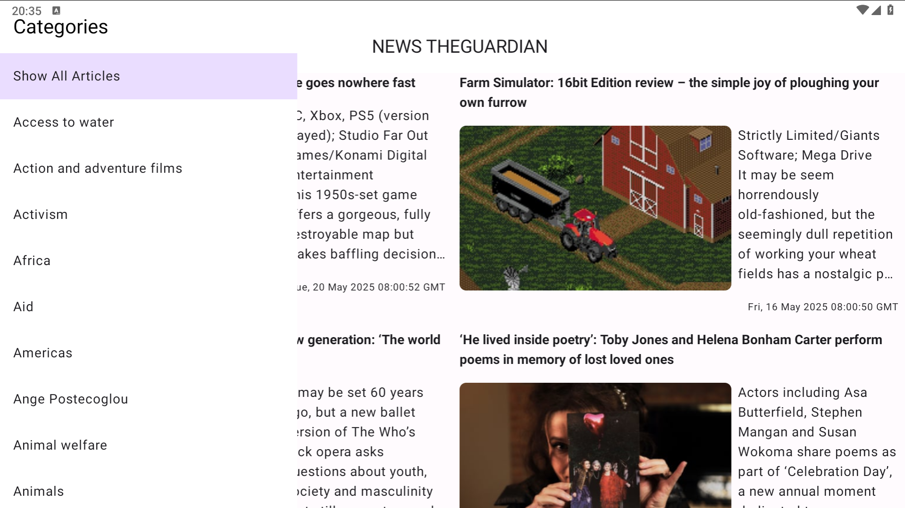

# Новостное приложение

Это новостное приложение предоставляет пользователям доступ к актуальным новостям из RSS-канала газеты Guardian. Новости отображаются в вертикальном списке с использованием компонента `LazyColumn`, где каждый элемент содержит заголовок, краткое описание и изображение. В нижнем правом углу отображается дата публикации.

## Основные функции:

- **Просмотр новостей**: Каждая новость открывается в новом экране с помощью `WebView`, используя URL из элемента `guid`.

- **Обновление новостей**: При свайпе вниз происходит обновление новостей.

- **Фильтрация по категориям**: Свайп вправо открывает панель с категориями, которые загружаются и отображаются в алфавитном порядке.
    - При нажатии на категорию происходит фильтрация новостей.
    - Выбор пункта "Show All Articles" отображает все новости.
    - Свайп влево закрывает панель без фильтрации.

- **Адаптивный интерфейс**: Если ширина экрана позволяет, новости отображаются в два столбца, в противном случае — в один.

- **Обработка ошибкок**: Приложение выведет на экран сообщение об ошибке, а нажав на кнопку `Retry` можно обновить страницу новостей. 

- Ниже продемонстрирована работа приложения

- Скриншот с открытой панелью категорий на устройстве 1920*1080(DPI 280)

- Видео работы приложения

- Видео отображения ошибки

## Дополнительные проекты

Для просмотра этого и других моих проектов, посетите [GitHub-репозиторий](https://github.com/K-Alena-S).